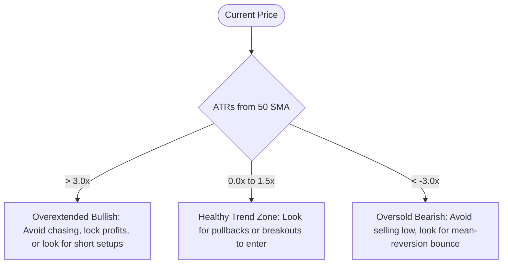

# Trading Decisions Guide: 20-Day ATR & SMA Distance

This guide outlines how to interpret the labels provided by the **20D ATR & SMA Distance** indicator to manage risk, identify potential reversal zones, and gauge market volatility.

---

## 1. Volatility Assessment (20D ATR %)
The **20D ATR %** tells you how volatile the stock is relative to its current price. 

* **How to interpret**:
  * **High ATR (> 4% - 5%)**: The stock is highly volatile. You can expect large daily swings. 
  * **Low ATR (< 1.5% - 2%)**: The stock is quiet and consolidating.
* **Trading Decision**:
  * **Position Sizing**: Reduce your position size on high ATR% stocks to keep your dollar-risk constant. A $10,000 position on a stock with a 5% ATR has a much higher daily risk than a $10,000 position on a stock with a 1% ATR.
  * **Option Strategy Selection**: 
    * *High ATR*: Good for selling premium (implied volatility is often elevated as well) or playing breakout momentum.
    * *Low ATR*: Good for buying cheap options (debit spreads, long calls/puts) before an expected breakout.

---

## 2. Distance from Trend (ATRs From 50SMA)
This is the core execution metric shown on the chart. It measures how extended the stock is from its medium-term trend line (the 50-day SMA), normalized by daily volatility.

* **How to interpret**:
  * **0x to 1.5x ATR**: The stock is close to its 50 SMA. This is a healthy trend zone.
  * **2.0x to 3.5x+ ATR (Bullish)**: The stock is highly extended to the upside (like the SMH chart showing 3.39x).
  * **-2.0x to -3.5x+ ATR (Bearish)**: The stock is highly extended to the downside.

* **Trading Decision**:
  * **Avoid Chasing**: If a stock is **> 3.0x ATRs** away from its 50 SMA (like SMH at 3.39x), the probability of a short-term pullback or consolidation is very high. **Do not buy here.**
  * **Take Profits / Trailing Stops**: When you see the ATR distance reach extreme levels (typically 3x or higher), it is a great time to scale out of long positions or tighten trailing stops.
  * **Mean Reversion / Counter-Trend**: Experienced traders use extreme ATR distances (e.g., > 3.5x or < -3.5x) as signals to trade mean-reversion (shorting the high, or buying the bounce) back towards the 50 SMA.

---

## 3. Today's Performance context (Today %)
Comparing today's price change to the average daily volatility (ATR) helps determine if a move is standard noise or a significant breakout.

* **Trading Decision**:
  * If **Today %** is **greater than the 20D ATR %** (e.g., Today is +5% and ATR is 3%), the stock is experiencing an **outlier day**. This usually indicates strong institutional buying/selling and can mark the start of a new trend or a capitulation top/bottom.
  * If **Today %** is small (e.g., Today is -0.2% and ATR is 3.5%), it's a low-volume consolidation day; do not overreact to intraday fluctuations.
